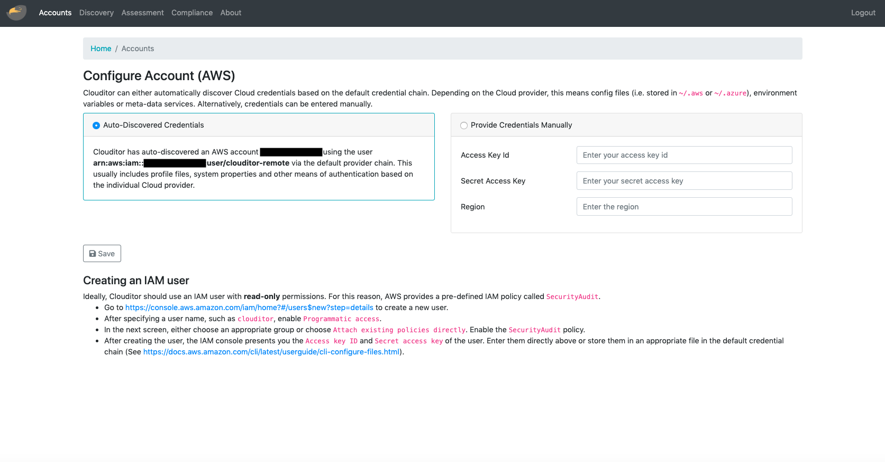
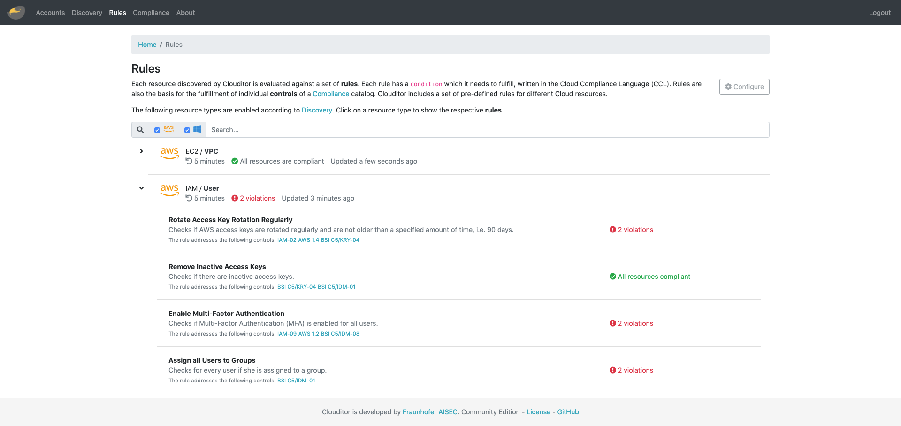
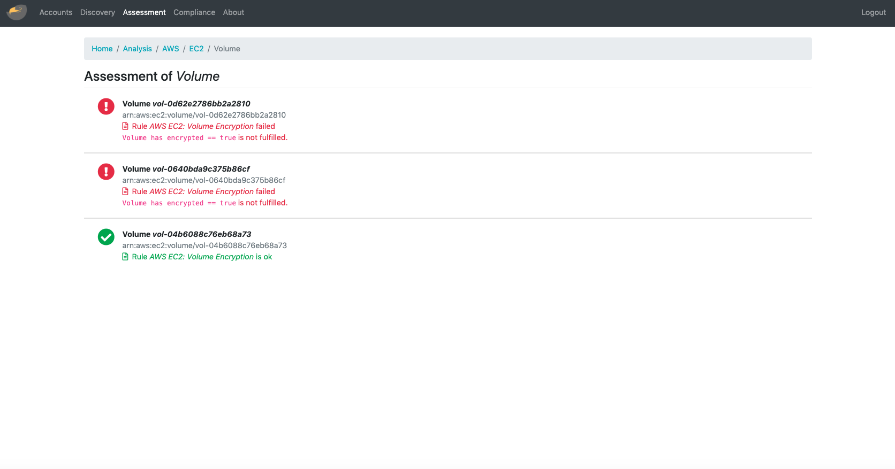
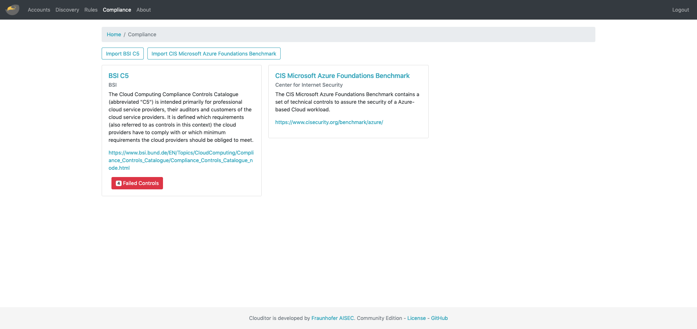

# Clouditor Community Edition

[](https://github.com/clouditor/clouditor/actions/workflows/build.yml)
[](https://github.com/clouditor/clouditor/actions/workflows/build-java.yml)
[](https://pkg.go.dev/clouditor.io/clouditor)
[](https://goreportcard.com/report/clouditor.io/clouditor)
[](https://codecov.io/gh/clouditor/clouditor)

> :warning: Note: We are currently in the transition of re-implementing most of the core functionality of Clouditor in Go. This choice will allows us to build a more scalable, microservice-friendly version of Clouditor. While the current Java code still resides in the project for now (in `legacy`), the majority of development work will go into the Go code. While we aim to replace most of the code, we still want to provide the same look and feel as before, so we decided NOT to brand this as a v2 release, but we are rather targeting to have a `v1.5` or later release with most of the functionality done. This is an intential break with our semver approach, but we feel it is necessary to circumvent some of the pitfalls of Go's enforced SIV-style for `v2` and later.
>
> If you are looking for a stable version using only the Java code, please use the [1.2.0](https://github.com/clouditor/clouditor/releases/tag/v1.2.0) release.


## Introduction

Clouditor is a tool which supports continuous cloud assurance. Its main goal is to continuously evaluate if a cloud-based application (built using, e.g., Amazon Web Services (AWS) or Microsoft Azure) is configured in a secure way and thus complies with security requirements defined by, e.g., Cloud Computing Compliance Controls Catalogue (C5) issued by the German Office for Information Security (BSI) or the Cloud Control Matrix (CCM) published by the Cloud Security Alliance (CSA).

## Features

Clouditor currently supports over 60 checks for Amazon Web Services (AWS), Microsoft Azure and OpenStack. Results of these checks are evaluated against security requirements of the BSI C5 and CSA CCM.

Key features are:

* automated compliance rules for AWS and MS Azure
* granular report of detected non-compliant configurations
* quick and adaptive integration with existing service through automated service discovery
* descriptive development of custom rules using [Cloud Compliance Language (CCL)](clouditor-engine-azure/src/main/resources/rules/azure/compute/vm-data-encryption.md) to support individual evaluation scenarios
* integration of custom security requirements and mapping to rules

## Usage

To run the Clouditor in a demo-like mode, with no persisted database:

```
docker run -p 9999:9999 clouditor/clouditor
```

To enable auto-discovery for AWS or Azure credentials stored in your home folder, you can use:

```
docker run -v $HOME/.aws:/root/.aws -v $HOME/.azure:/root/.azure -p 9999:9999 clouditor/clouditor
```

Then open a web browser at http://localhost:9999. Login with user `clouditor` and the default password `clouditor`.


## Screenshots

#### Configuring an account


#### Discovering resources of cloud-based application


#### Overview of rule-based assessment 



#### View details of rules



#### Load and map compliance requirements



## Development

### Code Style

We use [Google Java Style](https://github.com/google/google-java-format) as a formatting. Please install the appropriate plugin for your IDE.

### Git Hooks

You can use the hook in `style/pre-commit` to check for formatting errors:
```
cp style/pre-commit .git/hooks
```

### Build (gradle)

To build the Clouditor, you can use the following gradle commands:

```
./gradlew clean build
```

### Build (Docker)

To build all necessary docker images, run the following command:

```
./gradlew docker
```

### Build (Go components) - Experimental

Install necessary protobuf tools.

```
go install google.golang.org/protobuf/cmd/protoc-gen-go \
google.golang.org/grpc/cmd/protoc-gen-go-grpc \
github.com/grpc-ecosystem/grpc-gateway/v2/protoc-gen-grpc-gateway \
github.com/googleapis/gnostic/apps/protoc-gen-openapi
```

Also make sure that `$HOME/go/bin` is on your `$PATH` and build:

```
go generate ./...
go build ./...
```

To test, start the engine with an in-memory DB

```
./engine --db-in-memory
```

Alternatively, be sure to start a postgre DB:

```
docker run -e POSTGRES_HOST_AUTH_METHOD=trust -d -p 5432:5432 postgres 
```

### Clouditor CLI

The Go components contain a basic CLI command called `cl`. It can be installed using `go install cmd/cli/cl.go`. Make sure that your `~/go/bin` is within your $PATH. Afterwards the binary can be used to connect to a Clouditor instance.

```bash
cl login <host:grpcPort>
```

#### Command Completion

The CLI offers command completion for most shells using the `cl completion` command. Specific instructions to install the shell completions can be accessed using `cl completion --help`.
