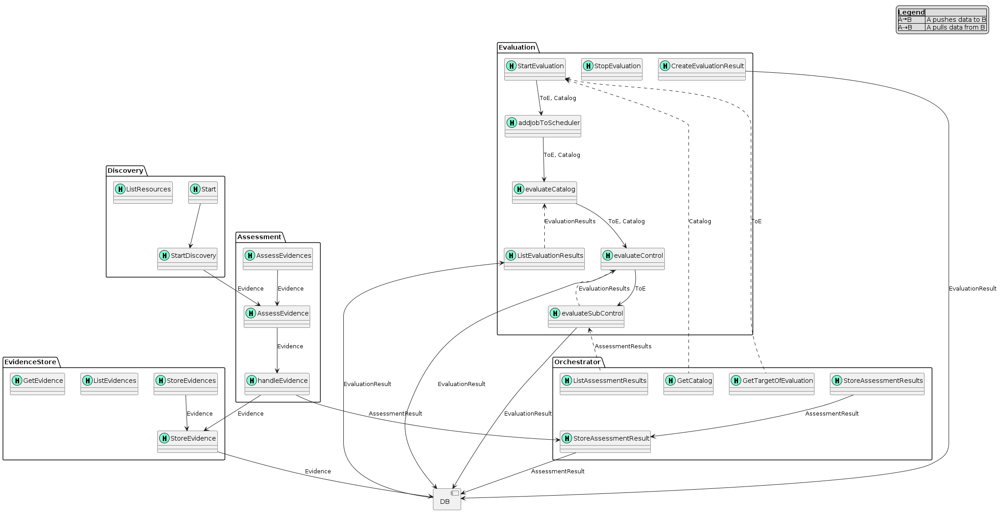

# Architecture
This is a brief description of the architecture and the components of Clouditor. 

## Architecture Overview
@TODO: add an image only with the components without the endpoints

The figure shows the core components of the tool Clouditor and how they interact with each other. 

## Components
The components correspond to the Clouditor are shortly described as follows.

**Discovery** gathers runtime configurations from cloud resources (e.g., Virtual Machine, Storage) and creates evidence with this information for further processing. These configurations could include the TLS version or whether the storage data is encrypted. Evidence is forwarded to the Assessment component for further processing.

**Assessment** is responsible for evaluating evidence based on predefined metrics.  The *Assessment* component creates an assessment result for each evidence which it gets and stores it in a database. Furthermore, it forwards each incoming evidence to the *Evidence Store*.

**Evidence Store** is the storage for the created evidence from the evidence collector component *Discovery*. Currently a Postgres DB is used.

**Orchestrator** is the central component orchestrating the micro-services of the Clouditor.

**Evaluation** evaluates (multiple) assessment results(s) to show the compliance for specific controls of a security catalog.
