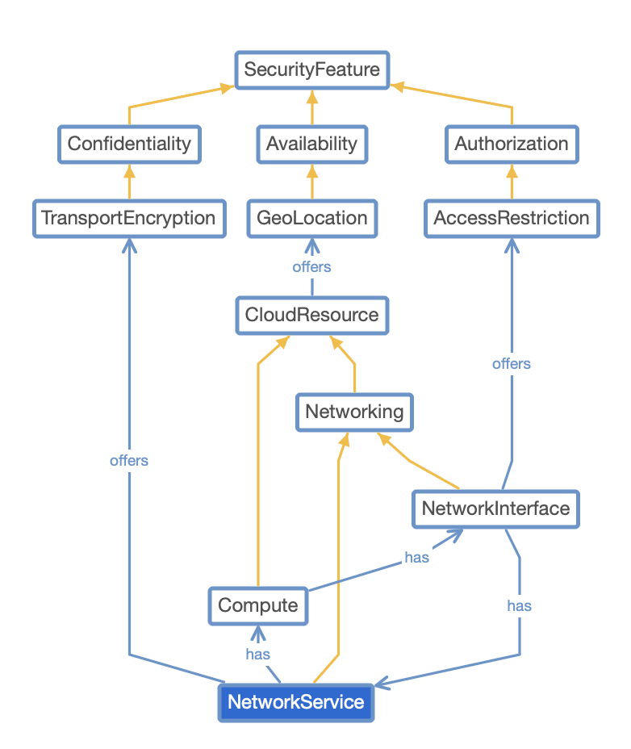

# Security Metrics
This repository collects security metrics that can be used for continuous certification. 

The repository is structured as follows.
- api: this folder is still preliminary. The idea is to define the metric data format in a programmatic way, e.g., using a protobuf file
- catalogs: the catalogs folder holds files for different certification catalogs, benchmarks, etc. These files encode the requirements of the catalogs and map them to metrics. This way, continuous certification tools that apply the metrics can map assess the degree of compliance of a given catalog later.
- metrics: this folder holds the actual metrics. It is structured into domains first and each domain contains a number of metric folders. One of these metric folders in turn holds the following information.
  - metric.yml: This file describes the metric data, e.g., a description and its target value (see the structure explanation below)
  - metric.rego: This file encodes the metric data as a [Rego](https://www.openpolicyagent.org/docs/latest/policy-language/) file that can automatically be evaluated using the [OPA](https://www.openpolicyagent.org) engine.
- ontology: This folder holds the ontology that underpins the metric descriptions, possibly in different versions. The ontology describes which resources a system can consist of, which security features they may offer, and much more (see below). The metric descriptions are based on the ontology terms. 

# The metric data structure
A metric is described by metadata and configuration properties. While the metadata is static, the configuration properties may be modified when the metric is used, since they are dependent on the system context.

Metadata
- id: a human-readable name that is also used as an id; it must therefore be unique
- description: a description of the metric. The description usually refers to a resource type it applies to, like a block storage, and a security property that should be fulfilled for that resource, like at-rest-encryption. It then refers to the configuration data. The metric description MUST use the ontology terms when referring to resource types and security properties and put them in brackets, e.g., [BlockStorage]. Also the reference to the configuration data must be referred to in brackets, e.g. [p1:AtRestEncryption].
- version: the version identifies the version of the metric as it may be changed over time
- comments: comments allow to add reasoning to the metric, explaining why it is necessary, in which contexts it may be useful, and the comments can be used to describe an example scenario for its application
Configuration data
- interval: the interval may be used by evidence collection tools to set the interval in which evidence for this metric is collected. It should be specified as an integer which refers to hours, e.g. 24 hours.
- operator: the operator can be one of the basic mathematical operators, like ==, >=, <
- targetValue: the target value is what the metric actually measures, for example it could specify 'true' as a the target value for the AtRestEncryptionEnabled metric

# Ontology
The ontology has been developed to harmonize evidence gathering and assessment across certifications, cloud vendors, and resource types. It was initially developed limited to cloud systems, but is being extended for other environments and technologies. 
It includes several taxonomies, including a taxonomy of cloud resources and a taxonomy of security properties. As an example, the cloud resource taxonomy includes computing resources which in turn can be virtual machines, containers or functions. This taxonomy classifies cloud resources across all major cloud providers and architectures, like Microsoft Azure, Amazon Web Services, Google Cloud Platform, and OpenStack. 
It is ordered by resource types, e.g., resources that can be used to execute code (virtual machines, serverless functions, etc.) are grouped in a Compute category, while resources that provide networking capabilities (virtual networks and subnetworks, IP addresses, routing rules, etc.) pertain to a Networking group. 

The security properties taxonomy classifies security properties that can configured in a (cloud)
service. We have ordered it by STRIDE categories, see also the image below. STRIDE is an acronym for the security threats
Spoofing, Tampering, Repudiation, Information Disclosure, Denial of Service, and Elevation of
Privilege. The security properties taxonomy includes their respective counterparts, i.e., the
protection goals Authentication, Integrity, Non-repudiation, Confidentiality, Availability, and Authorization.
The Confidentiality category, for example, includes encryption as a security property, while the
Integrity category includes the immutability property which may be implemented by some
storage resources.

Without harmonizing evidence gathering across cloud vendors, creating metrics and assessing evidence would be much more tedious, since, e.g., two resources hosted by different cloud providers but with similar security properties have to be parsed by dedicated pieces of code, and measured by dedicated metrics.
A further advantage of this harmonization is that requirements defined in different certifications
or catalogs can be assigned to the ontological concepts they refer to. This assignment to a
common ontological classification allows to assess evidence collectively and improves the
assessment’s reusability and modifiability. The ontological types can therefore be used in metric
definitions related to the certifications and catalogues. This way, metrics are defined for abstract
resource types, e.g., object storages, and their security properties, e.g., at-rest-encryption,
rather than for cloud-provider-specific properties; e.g., an encryption property that is specifically
defined for an AWS S3 bucket. For further explanation, see our publication on semantic evidence-based continuous certification [1].

The ontology has been created using Protegé and is published in the online Protegé platform
webprotege.

# Further reading
[1] Banse, Christian, et al. "A Semantic Evidence-based Approach to Continuous Cloud Service Certification." Proceedings of the 38th ACM/SIGAPP Symposium on Applied Computing. 2023.
